## The Behavioral Risk Factor Surveillance System (BRFSS)

_The Behavioral Risk Factor Surveillance System (BRFSS)_ is the nation’s premier system of health-related telephone surveys that collect state data about U.S. residents regarding their health-related risk behaviors, chronic health conditions, and use of preventive services. Established in 1984 with 15 states, BRFSS now collects data in all 50 states as well as the District of Columbia and three U.S. territories. BRFSS completes more than 400,000 adult interviews each year, making it the largest continuously conducted health survey system in the world. 

(Courtsey: [CDC](https://www.cdc.gov/brfss/index.html))

_The questions of this project centered around the Behavioral Risk Factor Surveillance System (BRFSS) run through the United States  Center for Disease Control (CDC). This project is a nationwide-phone based survey that aims to find connections between behaviors people exhibit and potential for future diseases or medical conditions. Originally started in 1984 and spanning across 15 states, it  now includes participants from all 50 states and 3 territories. At 400,000 adults interviews per year, it has become the most  extensive medical survey worldwide._

_This project focused on the 2015 data and a small subset of the factors questioned about. As far as diseases, included is: cancer, high cholesterol, diabetes, heart disease, and high blood pressure. In order to see the impact of both positive and negative  behaviors on health, two of each are included. In the beneficial behavior section is fruit and vegetable intake per day and minutes  of physical activity per day and in the negative section is alcohol consumption per day  and smoking rate per day. As far as  demographics body mass index (BMI), education level, and state of residence are included._

* Null Hypothesis:

* Behavior Patterns has no impact on diseases we develop in life.

* Trends/Analysis

_First, we analyzed the relation between our four behaviors and three demographic levels._ 

### Weight Vs Positive Habbits

* Weight in Lbs Vs Fuits and Vegetables/Day

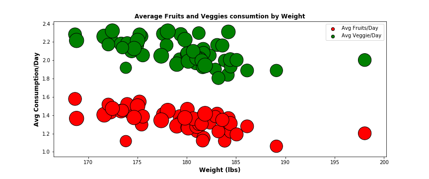

fig(1)

_Analysis/Trend_

The trend shows that as the weight starts increasing fruit and veggie consumption goes down. Qtn 1) Does that mean, 175 to 185 is the ideal weight to have? 2) Or does it show that our apetite has somethign to do with our weight? 3) Also people seem to eat more veggies than fruits?

* Weight in Lbs Vs Minutes of Physical Activity/Day

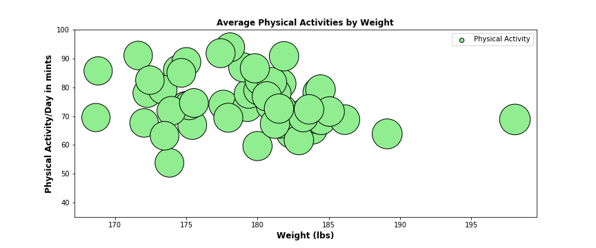

fig(2)

_Analysis/Trend_

-We see a trend that 174 to 185 lbs, people tend to exercise more and as weight increases no exercixe. -Are people more motivated to exercixe when they weigh less?_

### Weight Vs Positive Habbits

* Weight in Lbs Vs Alcohol consumption per day

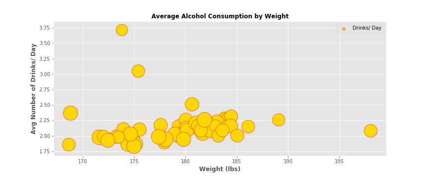

fig(3)

_Analysis/Trend_

_There's no trend seen with number of drinks taken as weight increases. -People in the weight category from 175 to 185 are taking on average 2 drinks per day??_

* Weight Vs Smoking rate per day

fig(4)

_Trend/Analysis_

_Based on the survey data, people who smoke daily have an average weight just above 176. But those with an average weight of 180 doesn't seem to smoke at all. Now also see that some with an average wt of 180 refused to answer to the survey question. Now not sure, if that means if they actually smoke or not interested in the survey. So basically not able to find any correlation between weight and smoking habits._

### Education Vs Positive Habbits

* Education Vs Fruit and vegetable intake per day

@Carmen pending the graph and analysis.

fig (5)

_Trend/Analysis_

* Education Vs Minutes of physical activity per day

@Carmen pending the graph and analysis.

fig(6)

_Analysis/Trend_

### Education Vs Negative Habbits

* Education Vs Alcohol consumption per day

@Carmen pending the graph and analysis.

_Analysis/Trend_

* Education Vs Smoking rate per day

@Carmen Wells Pending

_Trend/Analysis_

### State of Residence Vs Positive Habits

* State of Residence Vs Fruit and vegetable intake per day (Top 10 States)

_Analysis/Trend_
Aziz pending

* State of Residence Vs  Minutes of physical activity per day

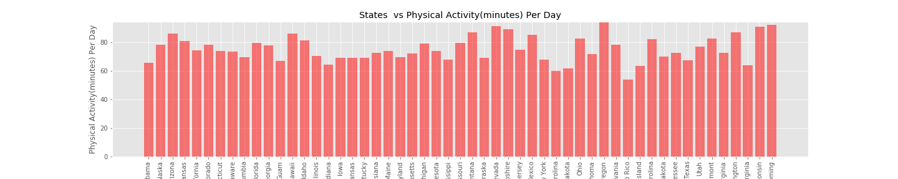

_Analysis/Trend_
Aziz pending

### State of Residence Vs Negative Habits

* State of Residence Vs Alcohol consumption per day

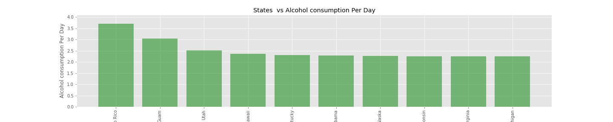

_Analysis/Trend_
Aziz pending

* State of Residence Vs Smoking rate per day

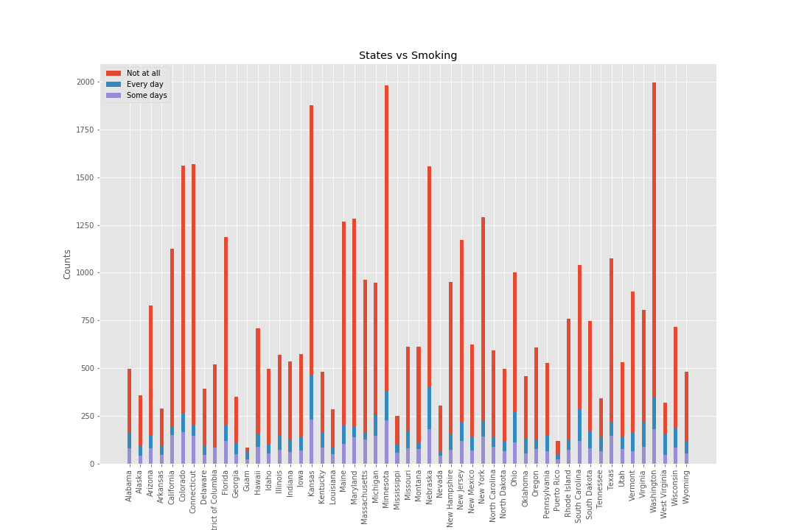

_Analysis/Trend_
Aziz pending

### Demographic factors Vs five diseases

* Body Mass Index (BMI) and Diseases

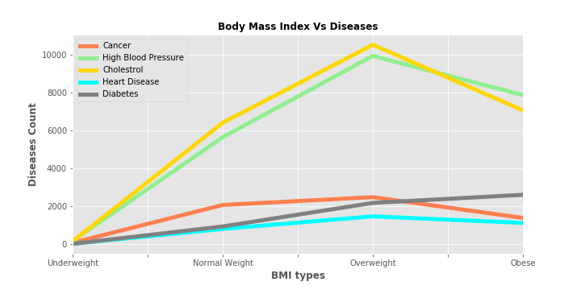

_Analysis/Trend_

_Based on survey data analysis, reported disease count increases as the BMI values goes from UnderWeight to Overweight and suddenly drops. Does that means it's good to be Obese than being Overweight? Or it could be that Obesity in younger age may not still be an issues Vs in older people._

* Education Level and Diseases

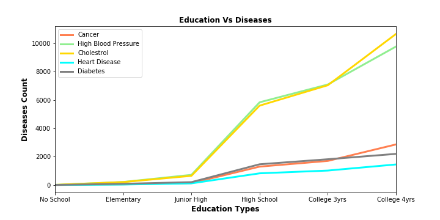

_Analysis/Trend_

_Based on the survery results, we see that as people are more educated, reported diseases also increases. 1) Education makes people aware more of their health issues? 2) Or more education, more stress and more health issues?_

* State of Residence and Diseases

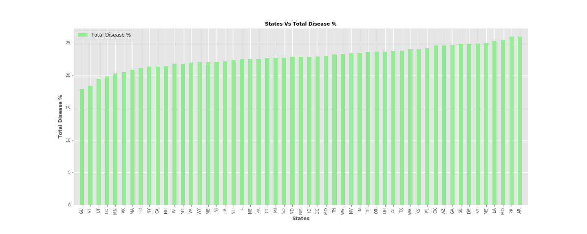

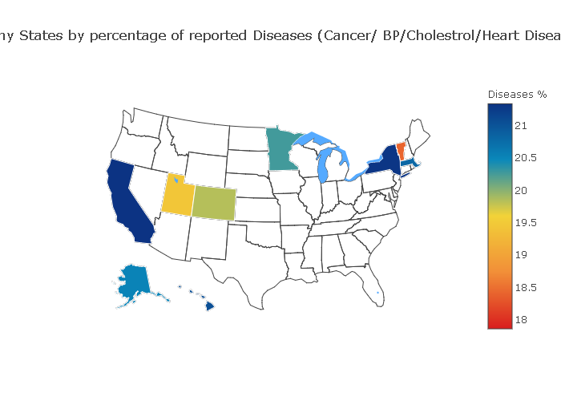

_Analysis/Trend_

_Percentage of diseases reported based on survey data shows that lowest percetgae reported is 17.86 by territory Guam followed by Vermont at 18.41%._

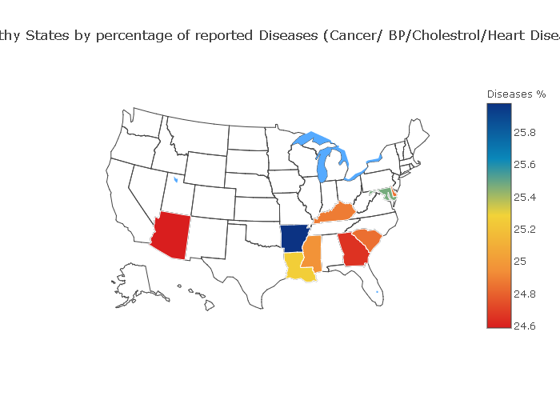

_Analysis/Trend_

_ Highest percentage is reported by Arizona at 25.98 followed by territory Puerto Rico (25.97), Maryland (25.47), LA (25.26) and Missouri (24.96) percentages. So seems like mostly southern states have reported more diseases that central and northern states. We can see that majority of the states that have reported highests diseases fall into the category of top 10 poorest states in US. ( Poorest states in US Louisiana, Mississippi, New Mexico, West Virginia, Alabama, Arkansas, Kentucky, South Carolina, Arizona, and Georgia._

_This indicates that more investment in health sector and educating the people in these states could be done._

###  Extra Demographic Challenges:

* Age Vs Disease

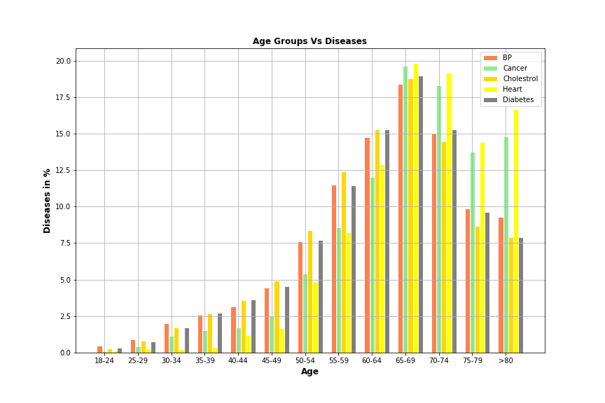

_Based on the survey data, Heart Disease looks to be the most prevalent disease among all age groups calculated percent wise. 65-69 age groups looks to be one suffering maximum from all diseases 17.5 to 20%] of people in the age groups affected with Cancer and Heart Disease being the top diseses. QTNs? 1)Is it because the median of living retiree left work is at 62 years old, and the most common age to retire was 62 years old. 2)Also once people, retire, insurance coverage might cease to exist if not enough retirement savings. 3)It is also alarming to notice the incidence of BP as the highest disease among 18-24 age groups though they represent only around 0.5% of the total respondents. This could be due to high level of stress, anxiety or issues with unemployment? 4) Every age groups, we can almost consistenly see Blood Cholestrol as the number 1 health risk factor. IS this due to lack of healthy food habits, and lack of physical activities?_

* Gender Vs Diseases

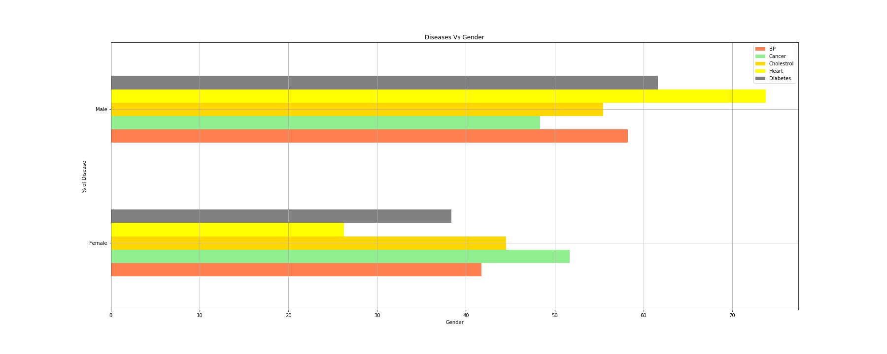

_Survey data shows that men outnumber women in all health risk indicatory with Heart disease being the top most one with 73.77%. Women with Cancer as the top most health risk indicator with 51.66%. But as per https.Cancer.gov, https://www.cancer.gov/about-cancer/understanding/statistics 1.8% per year among men from 2006 to 2015 1.4% per year among women from 2006 to 2015 -It could be because, the sample data we have collected not actually representing the actual population._

_Qtns: 1) Is it because many of contributing factors of Heart disease are Drinking, Smoking Obesity which might be common issues among Men than Women? 2) The survey data shows that Women mostly affected by Cancer though_

### Country wise status on 5 Health Risk indicators.

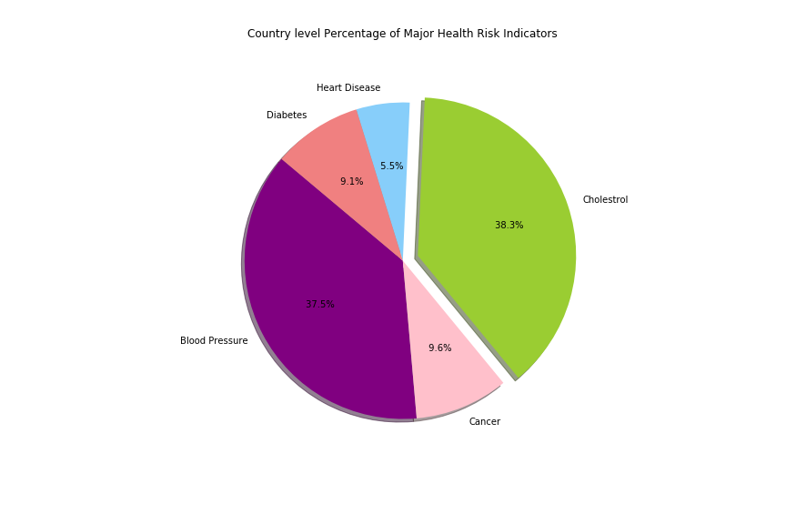

_Analysis/Trend_

_Based on the survey data, Cholestrol is the most prevalent health risk factor (38.3%) in the country follwed by High Blood Pressure (37.5%), Cancer (9.6%), Diabetes (9.1%) and Heart Disease (5.5%)._

_Below are the latest percentages we have obtained from CDC website as it's prevalent now._

* CDC Facts

[Cholestrol - 71 million American adults (33.5%)](https://www.cdc.gov/dhdsp/data_statistics/fact_sheets/fs_cholesterol.htm)

[Blood Pressure - 75 million American adults (32%)](https://www.cdc.gov/dhdsp/data_statistics/fact_sheets/fs_bloodpressure.htm)

[Cancer -23.2 million American Adults (9.4%)](https://www.cdc.gov/nchs/fastats/cancer.htm)

[Heart Disease - 28.2 million Americans (11.5%)](https://www.cdc.gov/nchs/fastats/heart-disease.htm)

[Diabetes - 30.3 million Americans Adults (9.4%)](https://www.cdc.gov/media/releases/2017/p0718-diabetes-report.html)
