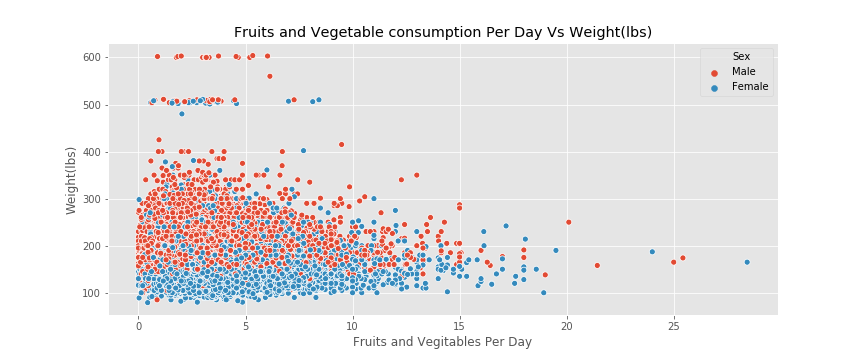
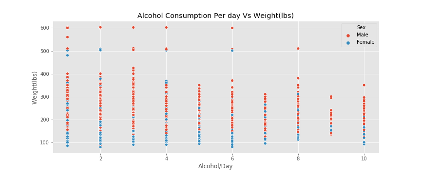
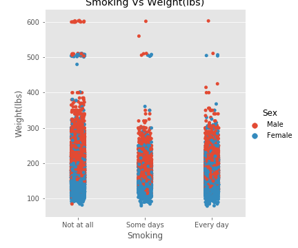
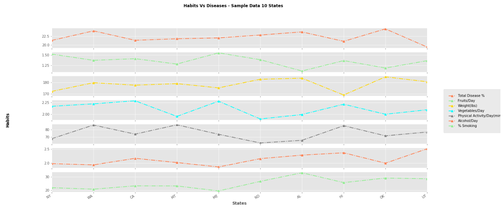
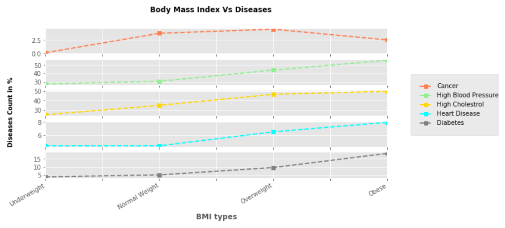
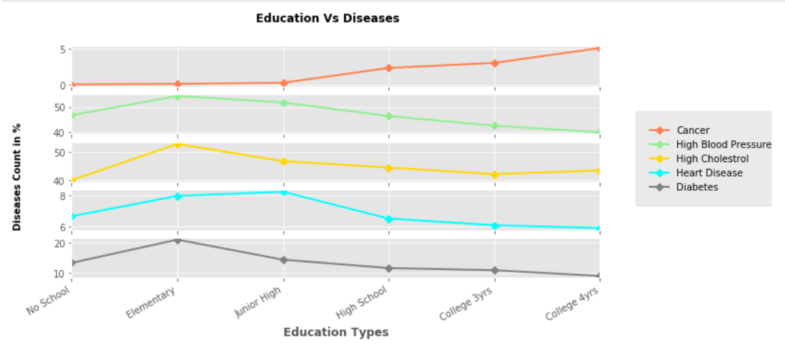
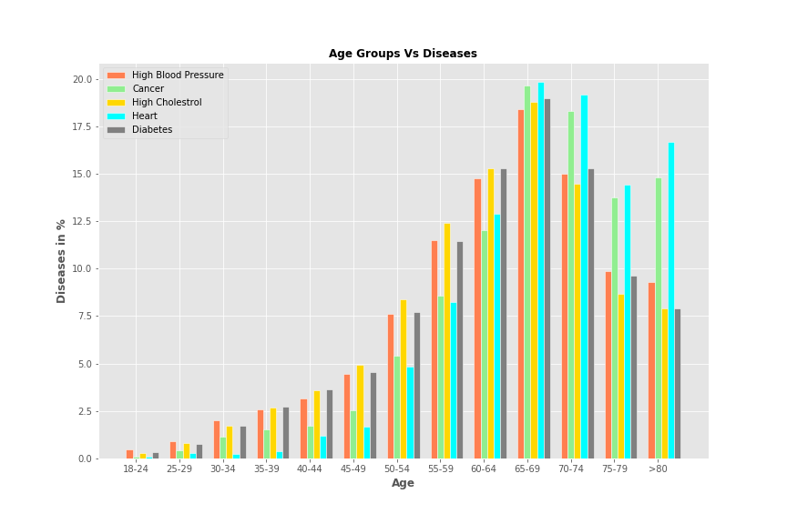

## The Behavioral Risk Factor Surveillance System (BRFSS)

_The Behavioral Risk Factor Surveillance System (BRFSS)_ is the nation’s premier system of health-related telephone surveys that collect state data about U.S. residents regarding their health-related risk behaviors, chronic health conditions, and use of preventive services. Established in 1984 with 15 states, BRFSS now collects data in all 50 states as well as the District of Columbia and three U.S. territories. BRFSS completes more than 400,000 adult interviews each year, making it the largest continuously conducted health survey system in the world. 

(Courtsey: [CDC](https://www.cdc.gov/brfss/index.html))

_This project focused on the 2015 data and a small subset of the factors questioned about. As far as diseases, included is: cancer, high cholesterol, diabetes, heart disease, and high blood pressure. In order to see the impact of both positive and negative  behaviors on health, two of each are included. In the beneficial behavior section is fruit and vegetable intake per day and minutes  of physical activity per day and in the negative section is alcohol consumption per day  and smoking rate per day. As far as  demographics body mass index (BMI), education level, and state of residence and age are included._

* Null Hypothesis:

* Behavior Patterns has no impact on diseases we develop in life.

### Data Exploration and Cleaning

_Original Raw Data Preview_

_Original MetaData_

_Reduced Raw Data Preview_

_Final Data_

_Final MetaData_

_Preview of Descriptive statistical Info_

_Pairwise Correlation of Numerical Data_

_First, we analyzed the relation between our four behaviors and three demographic levels._ 

### Data Analysis

#### Weight Vs Positive Habits

* Questions :
1) Are men or women more physically active? 
2) Do men or women have healthier habits?

* Weight in Lbs Vs Fuits and Vegetables/Day

_Analysis/Trend_

The trend shows that as the consumption of Fruit and Vegatbales increases, weight also tend to reduce. Women seems to eat less fruits than men. Even though there are some people with more than 400 lbs weight with a consumption of total 5 fruits and veggies together, average weight remains less than 300 lbs.

* Weight in Lbs Vs Minutes of Physical Activity/Day

_Analysis/Trend_

_We can see that as more minutes spent on physical activity, no cases of weight increase is seen. But most of the people perform physical activity in 0 to 500 minutes. No we are not sure what kind of physical activities people are referring to as there are good amout of people in the range of 500 to 1000 minutes also. Some occupations also demand physically strenuous work to be done. On the whole women tend to perfome less physical activites and also 80 to 150 lbs whereas men who perform low physical activity seems weight higher reaching up to 600 lbs._

#### Weight Vs Negative Habits

* Question : 
1) Is there an identifiable trend between weight and smoking? drinking?

* Weight in lbs Vs Alcohol consumption per day

_Analysis/Trend_

__

* Weight Vs Smoking rate per day

_Trend/Analysis_

_There is no specific trend seen on weight with smoking and mostly weight range between 100 and 300 for people smoke some days or every day. Also women smoke less than men_

#### Education Vs Habits

* Questions
    1) Is there an identifiable trend between education level and smoking? drinking?
    

_Trend/Analysis_

_The trend shows that as people are getting more educated, some of the bad habits are reducing. ( Alcohol consumption and % of people Smoking). At the same time fruits consumption is increasing but drop in vegetable consumption per day and physical activities. The more educated, people get busier and less time for exercie may be? But overall, education drives awareness._

#### State of Residence Vs Habits and Health Risks

* Questions:
    1) Is drinking contributing to any of the diseases and  which one?
    2) What trend can be seen with various habits and diseases?
    3) Is alcohol more dangerous than smoking according to the survey results?
    4) States with highest adult smoking ?
    5) Which state top high alcohol consumption?
    6) Any trend seen in diseases reported based on the states/location where they live?

In this analysis, we have randomly chosen 10 states and comparing the total disease % against various habits.

_Trend/Analysis_

* Top 10 Fruit and Veggie consumption states

_Analysis/Trend_

* Top States by Smoking rate per day

_Analysis/Trend_

_In terms of the data itself, this chart shows which states have the most participants in the actual survey. According to this data, northern states appear to have a greater number of partipants in general._

_Analysis/Trend_

* Top States by Alcohol consumption per day

_Analysis/Trend_

_Puerto Rico and Guam have the highest alcohol consumption per day out of all of the states and territories listed. Does this indicate that the residents of the U.S. territories consume more alcohol on average than the residents of the states? Further, both Hawaii and Alaska are within the top ten. Does this further the argument that the areas seperated from the mainland consume more alcohol?_

* States by Physical Activities per day

_Analysis/Trend_

_Wyoming, Nevada and Oregan appear to be the most active states. These are all relatively Nortern states._

#### Demographic factors Vs five Health Risk Indicators.

* Questions:
1) Is there any trend we see with BMI with diseases we develop?
2) Any trend on health risk indicators based on education level of the people?

* Body Mass Index (BMI) and Health Risk Indicators

_Analysis/Trend_

_It appears that occurrences of cancer peak within the overweight BMI range but lessen again within the obese range. Does this indicate a lack of relation between cancer and weight issues? The four other diseases (high blood pressure, high cholesterol, heart disease, and diabetes) and increased BMI appear to be directly correlated._ 

* Education Level and Health Risk Indicators

_Analysis/Trend_

_Instances of diabetes peak dramatically for those who were only educated at a high school level. We already saw that diabetes is related to a higher BMI and that more educated people exhibit healthier habits. Is that what we're seeing here. Alternatively, is this number high because diabetes can impact the youth as well? Are we seeing the number of people unable to continue education due to illness? Heart disease, high cholesterol, and high blood pressure levels are all highest for people who only completed elementary or junior high. This matches the diabetes data as well. This indicates that those who have some level of education but never completed high school are most likely to suffer from these diseases. Alternatively, cancer appears to not follow this trend. It increases as people become more educated._

* State of Residence and Health Risk Indicators

_Analysis/Trend_

_Eight out of the ten top healthy states are connected to large bodies of water. Percentage of diseases reported based on survey data shows that lowest percentage reported is 17.86 by territory Guam followed by Vermont at 18.41%._

_Analysis/Trend_

_Highest percentage is reported by Arizona at 25.98 followed by territory Puerto Rico (25.97), Maryland (25.47), LA (25.26) and Missouri (24.96) percentages. So seems like mostly southern states have reported more diseases that central and northern states. We can see that majority of the states that have reported highest diseases fall into the category of top 10 poorest states in US. ( Poorest states in US Louisiana, Mississippi, New Mexico, West Virginia, Alabama, Arkansas, Kentucky, South Carolina, Arizona, and Georgia._

_This indicates that more investment in health sector and educating the people in these states could be done._

####  Extra Demographic Analysis:

* Age Vs Health Risk Indicators

_Based on the survey data, Heart Disease looks to be the most prevalent disease among all age groups calculated percent wise. 65-69 age groups looks to be one suffering maximum from all diseases 17.5 to 20%] of people in the age groups affected with Cancer and Heart Disease being the top diseases. QTNs? 1)Is it because the median of living retiree left work is at 62 years old, and the most common age to retire was 62 years old. 2)Also once people, retire, insurance coverage might cease to exist if not enough retirement savings. 3)It is also alarming to notice the incidence of Blood Pressure as the highest disease among 18-24 age groups though they represent only around 0.5% of the total respondents. This could be due to high level of stress, anxiety or issues with unemployment? 4) Every age groups, we can almost consistently see High Blood cholesterol as the number 1 health risk factor. IS this due to lack of healthy food habits, and lack of physical activities?_

* Gender Vs Health Risk Indicators

* Questions :
    1. What trend can be seen between age groups and type of diseases?
    2. Any trend can be seen between gender type and type of diseases?
    

_Survey data shows that men outnumber women in all health risk indicatory with Heart disease being the top most one with 73.77%. Women with Cancer as the top most health risk indicator with 51.66%. But as per https.Cancer.gov, https://www.cancer.gov/about-cancer/understanding/statistics 1.8% per year among men from 2006 to 2015 1.4% per year among women from 2006 to 2015 -It could be because, the sample data we have collected not actually representing the actual population._

_Qtns: 1) Is it because many of contributing factors of Heart disease are Drinking, Smoking Obesity which might be common issues among Men than Women? 2) The survey data shows that Women mostly affected by Cancer though_

_On average, Americans can now expect to live 78.6 years, a statistically significant drop of 0.1 year, according to a report on 2016 data published Thursday by the National Center for Health Statistics. Women can now expect to live a full five years longer than men: 81.1 years vs. 76.1 years._ [link](https://www.smithsonianmag.com/smart-news/us-life-expectancy-drops-third-year-row-reflecting-rising-drug-overdose-suicide-rates-180970942/)

#### Country wise status on 5 Health Risk indicators.

_Analysis/Trend_

_Based on the survey data, Cholestrol is the most prevalent health risk factor (38.3%) in the country follwed by High Blood Pressure (37.5%), Cancer (9.6%), Diabetes (9.1%) and Heart Disease (5.5%)._

_Below are the latest percentages we have obtained from CDC website as it's prevalent now._

* CDC Facts

[Cholestrol - 71 million American adults (33.5%)](https://www.cdc.gov/dhdsp/data_statistics/fact_sheets/fs_cholesterol.htm)

[Blood Pressure - 75 million American adults (32%)](https://www.cdc.gov/dhdsp/data_statistics/fact_sheets/fs_bloodpressure.htm)

[Cancer -23.2 million American Adults (9.4%)](https://www.cdc.gov/nchs/fastats/cancer.htm)

[Heart Disease - 28.2 million Americans (11.5%)](https://www.cdc.gov/nchs/fastats/heart-disease.htm)

[Diabetes - 30.3 million Americans Adults (9.4%)](https://www.cdc.gov/media/releases/2017/p0718-diabetes-report.html)
